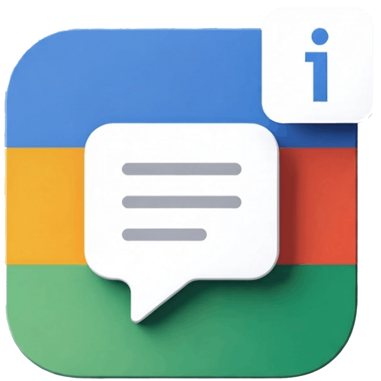

<p align="left">
  
</p>

# ContextLingo

Look up any word in context with dictionary definitions, AI explanations, and Anki integration.

A modern Chrome extension for language learners, built for YouTube, Netflix, Amazon Prime, and regular web pages (including PDFs).

## Features

- **Interactive subtitles**: Hover and click on subtitle words for instant definitions.
- **AI context analysis**: Get contextual translations, grammar breakdowns, and nuance from **Mistral**, **Ollama** (local), **OpenAI**, or **Gemini**.
- **Anki integration**: Create Cloze or Basic cards from selected subtitles and send them directly to your local Anki app.
- **Universal support**: Works on major streaming services and supports right-click translation on normal web pages and local PDFs.

## Installation

### Prerequisites

- Google Chrome or any Chromium-based browser (Edge, Brave, etc.).
- Optional but recommended: [Anki](https://apps.ankiweb.net/) desktop app with [AnkiConnect](https://ankiweb.net/shared/info/2055492159).

### Load as an unpacked extension

1. Clone the repository:

```bash
git clone https://github.com/YOUR-USERNAME/interactive-subtitle-dictionary.git
cd interactive-subtitle-dictionary
```

2. Install dependencies:

```bash
npm install
```

3. Build the extension:

```bash
npm run build
```

4. Open `chrome://extensions/`.
5. Enable **Developer mode**.
6. Click **Load unpacked**.
7. Select the generated `dist/` directory.

## AI Configuration

To use AI features, add an API key for one of the supported providers in the extension Options page.

### Supported Providers

- **Mistral AI** (default, fast)
- **Ollama** (free, private, local)
- **OpenAI** (high quality)
- **Google Gemini** (high quality, generous free tier)

See [CONTRIBUTING.md](CONTRIBUTING.md) if you want to add support for a new provider.

## Contributing

Contributions are welcome. See [CONTRIBUTING.md](CONTRIBUTING.md) for workflow and contribution details.

## Developer

- **Name**: Mehdi Nickzamir
- **Website**: [mehdinickzamir.com](https://mehdinickzamir.com)
- **Email**: [mehdi.nickzamir99@gmail.com](mailto:mehdi.nickzamir99@gmail.com)
- **LinkedIn**: [linkedin.com/in/mehdi-nickzamir](https://www.linkedin.com/in/mehdi-nickzamir/)

## License

This project is licensed under the MIT License. See [LICENSE](LICENSE) for details.

## Privacy

For Chrome Web Store listing and data handling details, see [PRIVACY.md](PRIVACY.md).
